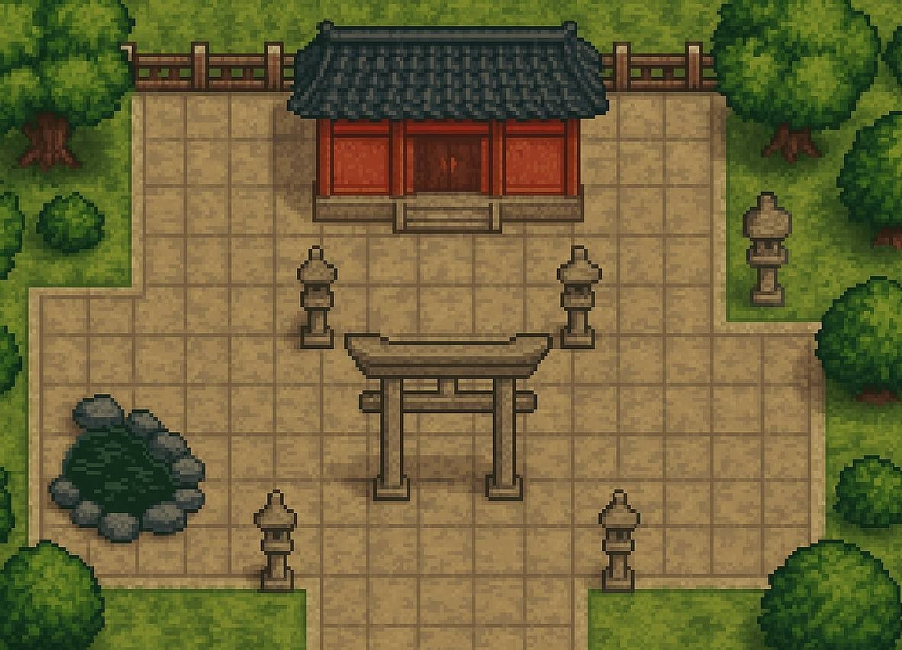

# TopDownFinalPR 🎮

A thrilling 2D top-down action game built with MonoGame and .NET 8, featuring intense combat, enemy AI, and survival gameplay.



## 🎯 Game Overview

TopDownFinalPR is an action-packed survival game where you control a warrior fighting against waves of enemies. Navigate through dangerous zones, shoot arrows at your foes, and survive as long as possible while managing your health and ammunition.

### ✨ Key Features

- **Dynamic Combat System**: Engage in real-time combat with responsive controls
- **Intelligent Enemy AI**: Face challenging enemies with advanced pathfinding and attack patterns
- **Smooth Animations**: Beautiful sprite-based animations for all characters
- **Audio Experience**: Immersive sound effects and background music
- **Multiple Game States**: Seamless transitions between menu, gameplay, and end screens
- **Health & Timer System**: Manage your survival against the clock

## 🎮 Gameplay

### Controls
- **WASD** - Move player character
- **Left Mouse Click** - Shoot arrows
- **M** - Toggle audio (mute/unmute)
- **ESC** - Exit to main menu

### Objective
Survive as long as possible while defeating enemies. Each enemy defeated increases your score, but be careful - enemies can damage you and reduce your health. The game ends when your health reaches zero.

### Game Mechanics
- **Health System**: Start with 100 HP, take damage from enemy attacks
- **Arrow Combat**: Aim and shoot arrows at enemies from a distance
- **Enemy AI**: Enemies actively pursue and attack the player
- **Collision Detection**: Realistic physics and collision responses
- **Timer System**: Track your survival time and performance

## 🚀 Getting Started

### Prerequisites

- **.NET 8 SDK** - [Download here](https://dotnet.microsoft.com/download/dotnet/8.0)
- **MonoGame Framework** - Included in project dependencies
- **macOS** (for building DMG distribution files)

### Quick Start

1. **Clone the repository**
   ```bash
   git clone <repository-url>
   cd TopDownFinalPR
   ```

2. **Build and run**
   ```bash
   dotnet restore
   dotnet build
   dotnet run
   ```

### Building for Distribution

#### Automated Build (Recommended)
Use the provided build script for all platforms:
```bash
chmod +x build-all.sh
./build-all.sh
```

This script automatically:
- Builds for Windows, macOS, and Linux
- Creates platform-specific packages
- Generates macOS DMG files
- Organizes distribution files

#### Manual Build Commands

**Windows (x64)**
```bash
dotnet publish -c Release -r win-x64 --self-contained true -p:PublishSingleFile=true -p:PublishTrimmed=true
```

**macOS (x64)**
```bash
dotnet publish -c Release -r osx-x64 --self-contained true -p:PublishSingleFile=true -p:PublishTrimmed=true
```

**Linux (x64)**
```bash
dotnet publish -c Release -r linux-x64 --self-contained true -p:PublishTrimmed=true
```

## 📁 Project Structure

```
TopDownFinalPR/
├── Content/                     # Game assets and resources
│   ├── Audio/                  # Sound effects and music
│   ├── Fonts/                  # Game typography
│   └── Sprites/                # Character and UI graphics
├── Core Game Systems/
│   ├── Game1.cs               # Main game loop and initialization
│   ├── GameManager.cs         # Game state management
│   ├── SceneManager.cs        # Object lifecycle management
│   └── AudioManager.cs        # Audio system
├── Gameplay Elements/
│   ├── Player.cs              # Player character logic
│   ├── Enemy.cs               # Enemy AI and behavior
│   ├── Arrow.cs               # Projectile system
│   └── Collider.cs            # Collision detection
├── UI System/
│   ├── MainMenuUIManager.cs   # Main menu interface
│   ├── InGameUIManager.cs     # HUD and gameplay UI
│   └── EndGameUIManager.cs    # Game over screen
├── Utilities/
│   ├── SpriteManager.cs       # Texture and sprite management
│   ├── TextManager.cs         # Text rendering system
│   └── TimerManager.cs        # Game timing system
└── Distribution/
    ├── build-all.sh           # Multi-platform build script
    └── TopDownFinalPR.app/    # macOS application bundle
```

## 🎨 Game Assets

### Characters
- **Player**: Fully animated warrior with idle, walk, attack, hurt, and death animations
- **Enemies**: Tengu enemies with multiple animation states and AI behaviors

### Audio
- **Background Music**: Atmospheric game music
- **Sound Effects**: Combat sounds, damage, death, and UI interactions

### Graphics
- **Backgrounds**: Multiple themed backgrounds for different game states
- **UI Elements**: Clean, intuitive interface elements
- **Sprites**: High-quality character and object sprites

## 🏗️ Architecture

The game uses a modern component-based architecture:

- **Scene Management**: Efficient object lifecycle and rendering pipeline
- **Component System**: Modular design for easy feature additions
- **Event-Driven**: Responsive collision and interaction systems
- **State Management**: Clean separation between game states

### Core Systems
- **SpriteManager**: Handles texture loading and sprite rendering
- **AudioManager**: Controls music and sound effect playback
- **EnemyManager**: Manages enemy spawning and AI coordination
- **PlayerManager**: Handles player creation and destruction
- **TimerManager**: Game timing and countdown functionality

## 📦 Distribution

### Windows
- **Executable**: `TopDownFinalPR.exe`
- **Dependencies**: `SDL2.dll`, `openal.dll`, `Content/` folder
- **Location**: `bin/Release/net8.0/win-x64/publish/`

### macOS
- **App Bundle**: `TopDownFinalPR.app/`
- **DMG File**: `TopDownFinalPR.dmg`
- **Dependencies**: `libSDL2-2.0.0.dylib`, `libopenal.dylib`, `Content/` folder
- **Location**: `bin/Release/net8.0/osx-x64/publish/`

### Linux
- **Executable**: `TopDownFinalPR`
- **Dependencies**: `Content/` folder
- **Location**: `bin/Release/net8.0/linux-x64/publish/`

## 🔧 Development

### Adding New Features
1. **New Game Objects**: Inherit from appropriate base classes
2. **UI Elements**: Implement `IUIElements` interface
3. **Animations**: Use the `Animation` class for sprite-based animations
4. **Audio**: Add sounds through `AudioManager`

### Code Style
- Follow C# naming conventions
- Use XML documentation for public methods
- Implement appropriate interfaces for game objects
- Maintain separation of concerns between systems

## 🐛 Troubleshooting

### Common Build Issues
- **Missing .NET 8**: Ensure latest SDK is installed
- **Dependencies**: Run `dotnet restore` before building
- **Permissions**: Make build script executable with `chmod +x build-all.sh`

### Runtime Issues
- **Missing Content**: Verify `Content/` folder is present
- **Native Libraries**: Check SDL2 and OpenAL availability
- **File Permissions**: Ensure executable files have proper permissions

### Platform-Specific
- **macOS**: Gatekeeper may block unsigned apps (right-click → Open)
- **Linux**: May need additional audio/video dependencies
- **Windows**: Ensure Visual C++ redistributables are installed

## 🤝 Contributing

We welcome contributions! Here's how you can help:

1. **Report Bugs**: Create detailed issue reports
2. **Feature Requests**: Suggest new gameplay elements
3. **Code Contributions**: Submit pull requests with improvements
4. **Asset Contributions**: Share new sprites, sounds, or music

### Development Setup
1. Fork the repository
2. Create a feature branch
3. Make your changes
4. Test thoroughly
5. Submit a pull request

## 📄 License

This project is provided as-is for educational and development purposes. Feel free to use, modify, and distribute according to your needs.

## 🙏 Acknowledgments

- Built with [MonoGame](https://www.monogame.net/) framework
- Developed using .NET 8
- Inspired by classic top-down action games

## 📞 Support

- **Issues**: Report bugs and problems via GitHub Issues
- **Discussions**: Join community discussions for help and ideas
- **Documentation**: Check code comments for implementation details

---

**Enjoy playing TopDownFinalPR!** 🎮✨

*Last updated: December 2024*
